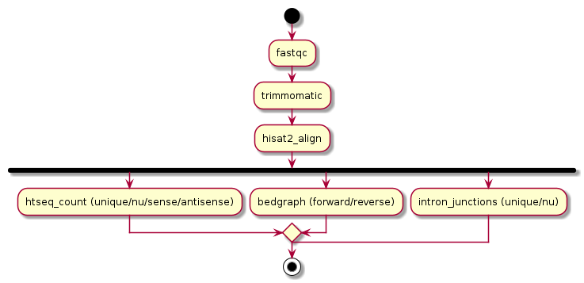

<!-- [](https://github.com/veupathdb/bulk-rnaseq-nextflow/actions/workflows/ci.yml)
[](https://github.com/veupathdb/bulk-rnaseq-nextflow/actions/workflows/linting.yml)[](https://doi.org/10.5281/zenodo.XXXXXXX)
[](https://www.nf-test.com)
-->
[](https://www.nextflow.io/)
[](https://www.docker.com/)
[](https://sylabs.io/docs/)


## Introduction

**veupathdb/bulk-rnaseq-nextflow** is a bioinformatics pipeline that aligns short RNASeq reads to genomic sequence.  It creates bedgraph, gene counts, alignment stats and intron juction files. 




## Usage

> [!NOTE]
> If you are new to Nextflow and nf-core, please refer to [this page](https://nf-co.re/docs/usage/installation) on how to set-up Nextflow. Make sure to [test your setup](https://nf-co.re/docs/usage/introduction#how-to-run-a-pipeline) with `-profile test` before running the workflow on actual data.

First, prepare a samplesheet with your input data that looks as follows:

`samplesheet.csv`:

```csv
sample,fastq_1,fastq_2
CONTROL_REP1,AEG588A1_S1_L002_R1_001.fastq.gz,AEG588A1_S1_L002_R2_001.fastq.gz
```

Each row represents a fastq file (single-end) or a pair of fastq files (paired end).


Now, you can run the pipeline using:


```bash
nextflow run veupathdb/bulk-rnaseq-nextflow \
   -profile docker \
   --input samplesheet.csv \
   --outdir <OUTDIR>
```

> [!WARNING]
> Please provide pipeline parameters via the CLI or Nextflow `-params-file` option. Custom config files including those provided by the `-c` Nextflow option can be used to provide any configuration _**except for parameters**_;
> see [docs](https://nf-co.re/usage/configuration#custom-configuration-files).

## Credits

veupathdb/bulk-rnaseq-nextflow was originally written by John Brestelli.

We thank the following people for their extensive assistance in the development of this pipeline:

Saikou Y Bah
Richard Demko


## Citations
An extensive list of references for the tools used by the pipeline can be found in the [`CITATIONS.md`](CITATIONS.md) file.

This pipeline uses code and infrastructure developed and maintained by the [nf-core](https://nf-co.re) community, reused here under the [MIT license](https://github.com/nf-core/tools/blob/master/LICENSE).

> **The nf-core framework for community-curated bioinformatics pipelines.**
>
> Philip Ewels, Alexander Peltzer, Sven Fillinger, Harshil Patel, Johannes Alneberg, Andreas Wilm, Maxime Ulysse Garcia, Paolo Di Tommaso & Sven Nahnsen.
>
> _Nat Biotechnol._ 2020 Feb 13. doi: [10.1038/s41587-020-0439-x](https://dx.doi.org/10.1038/s41587-020-0439-x).
